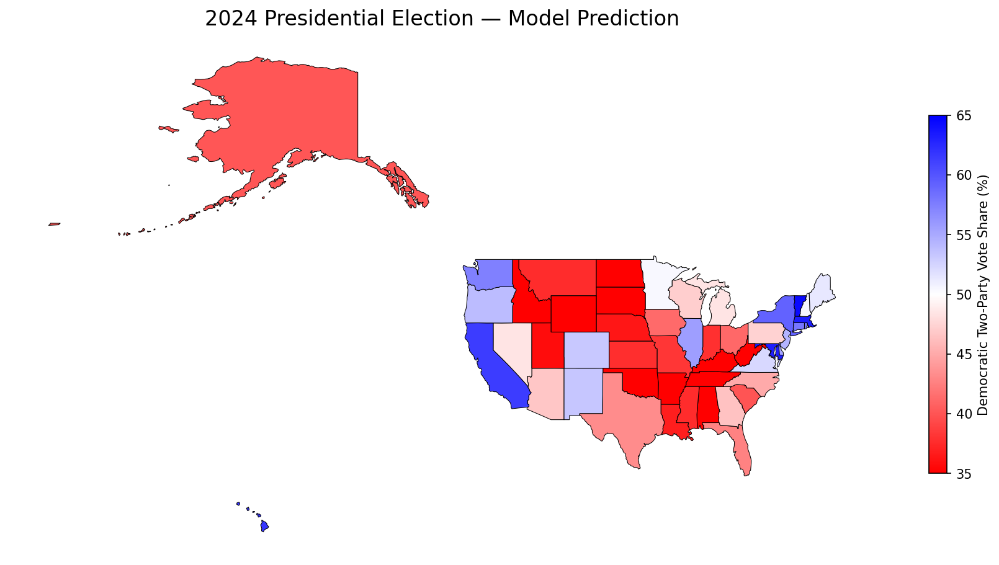

# electionPredict

This is a prediction model that uses economic indicators, national polling averages, and an ensemble of Linear Regression and Random Forest to forecast electoral college outcomes.

Here is a scenario where I asked the model to predict the 2024 election based on the above information, and the model predicts a Republican win with 312 EVs over 223 votes for the Democrats. The actual result in 2024 was 312 R - 226 D which is a 3 EV gap, which can be explained by the fact that the model doesn't consider Maine and Nebraska's electoral system, which distribute their electoral votes by congressional districts.

All seven major swing states were called correctly. The predicted percentages are within 3 points of the actual results. Nevada, especially, came within 0.1% of the actual result.



## 2024 Swing State Predictions

```
State           Predicted Dem %  Actual Dem %  Call    Correct
Georgia         46.5%               48.9%       REP     Yes
Arizona         46.7%               47.2%       REP     Yes
Wisconsin       47.1%               49.6%       REP     Yes
Pennsylvania    47.3%               49.1%       REP     Yes
Nevada          48.4%               48.5%       REP     Yes
Michigan        48.5%               49.3%       REP     Yes
Minnesota       50.4%               52.1%       DEM     Yes
```

## Methodology

### Data Pipeline

The data for previous election results comes from the MIT Election Data and Science Lab, freely accessible from a HuggingFace dataset as a CSV file. The dataset covers state level presidential results from 1976 to 2020. This data was then filtered to just the two major party candidates (excluding Write-ins) and then the data was pivoted so each row represents one state in one election year.

The vote percentage given are two-party percentages i.e. (Dem votes)/(Dem votes + Rep Votes). This removes third party noise from the calculation, which makes it comparable across the election years. If this were not done, 1992 where Ross Perot won 19% of the total vote would throw off the entire dataset.

### Feature Engineering

The model takes in six features:

**Prior state margin** is how the state voted in the previous cycle. This is the single strongest predictor. States are historically sticky and rarely swing more than a few points between elections.

**Incumbency** is a binary variable indicating which party currently holds the White House (1 for Democrat, 0 for Republican).

**National polling average** is the Democratic two-party share from final pre-election polls. I used Gallup's final estimates for 1976 through 2012 and RealClearPolitics averages for 2016 onward. An earlier version of the model used the actual national vote share here, which introduced data leakage since you would not have that number before election day. I caught this and replaced it with polling data.

**Presidential approval, inflation, and unemployment** are all directionally encoded. The raw numbers don't predict Democratic performance on their own. What matters is whether the economy is good or bad for whichever party is currently in power. I compute a sign variable that is +1 when a Democrat is the incumbent and -1 when a Republican is the incumbent, then multiply each indicator by that sign. High inflation under a Democratic president becomes a negative signal for Democrats. The same inflation under a Republican president becomes a positive signal for Democrats. This lets the model learn a single relationship: economic conditions help or hurt the party in power.

### Models

I train two models separately and average their outputs:

Linear regression works well in typical election years and stays stable when training data is limited. In the early backtest years, there are only one or two prior cycles to learn from, and LR handles that better than more complex models.

Random forest (100 trees, random_state=42 for reproducibility) picks up nonlinear patterns that LR misses. It performs better in unusual election years like 1992 and 2004, but it needs more data to be reliable.

The ensemble average of both models outperformed either one individually in most backtest years. This happens because the two models tend to make errors in different directions, so averaging partially cancels them out.

### Backtesting

I use leave-one-cycle-out cross-validation. For each election year, the model trains only on elections that occurred before it. No future information is used during testing.

```
Year    LR      RF      Ensemble
1984    5.71    5.15    5.28
1988    9.74    9.12    9.43
1992    29.91   7.35    11.40
1996    10.03   4.55    6.63
2000    14.00   4.22    6.92
2004    8.50    4.22    5.22
2008    6.06    3.67    3.54
2012    3.73    2.72    2.53
2016    2.85    2.98    2.86
2020    1.10    3.03    1.74
```

Values are mean absolute error in percentage points per state. The high error in early years reflects the limited training data available. By the 2012-2020 range, the ensemble consistently stays under 3 points per state.

## Comparison with Professional Models

This is a fundamentals-based model. It uses national-level economic data, approval ratings, and polling to make predictions. Professional forecasting operations like FiveThirtyEight and The Economist start from the same foundation but add several things on top.

The biggest difference is state-level polling. FiveThirtyEight ingested hundreds of individual state polls weighted by pollster track record, recency, and sample size. The Economist used a Bayesian setup where the model started the cycle relying on fundamentals and gradually shifted weight toward polls as election day approached. I only use a single national polling number.

Both professional models also incorporated demographic data. They tracked how specific voter groups (college-educated voters, Hispanic voters, etc.) were shifting nationally and then projected those shifts onto each state based on its demographic composition.

Another gap is state correlation. In reality, if the polls are off in Pennsylvania, they are probably also off in Michigan and Wisconsin. FiveThirtyEight and The Economist both modeled this correlation so that their simulations produced realistic error patterns across states. My model treats each state independently.

Finally, the professional models produced probabilistic outputs. Rather than saying "Democrats win Pennsylvania," they would say "Democrats have a 67% chance of winning Pennsylvania" based on thousands of simulated elections. My model only outputs point estimates.

Despite not having any of those features, the 2024 prediction landed within 3 electoral votes of the real outcome, which suggests the fundamentals-based approach is a reasonable foundation to build on.

## Roadmap

**v2** will add state-level polling averages, weighted by recency and sample size, blended with the fundamentals baseline. This version will also attempt to model the Maine and Nebraska district splits.

**v3** will incorporate Cook PVI scores, midterm election results as a leading indicator, US Census demographic data by state, and possibly candidate-level features like fundraising totals.

**v4** will move to probabilistic forecasting with Monte Carlo simulations, a state correlation matrix for realistic error modeling, and win probabilities per state instead of point estimates. I also plan to test XGBoost or LightGBM as the base model.

## Project Structure

```
electionPredict/
├── data/
│   └── 1976-2020-president.csv
├── src/
│   ├── __init__.py
│   ├── data_loader.py
│   ├── features.py
│   ├── model.py
│   └── visualize.py
├── main.py
├── .gitignore
└── README.md
```

## Setup

```bash
git clone https://github.com/FudoKun/electionPredict.git
cd electionPredict
pip install pandas scikit-learn geopandas matplotlib
python main.py
```

## Known Limitations

Maine and Nebraska split their electoral votes by congressional district, but the model treats every state as winner-take-all. Modeling individual districts would require sub-state polling or demographic data that is not yet incorporated.

The training set only contains 12 presidential election cycles (1976 to 2020). This limits how complex the model can be before it starts overfitting, and it is the main reason why error is higher in the earlier backtest years.

There are no state-level polls in v1. The model relies on each state's prior voting history and the national environment to make predictions. It cannot capture real-time state-specific shifts like differential campaign spending or local issue salience. This is the primary improvement planned for v2.

## Data Sources

Election returns: [MIT Election Data and Science Lab, Harvard Dataverse](https://dataverse.harvard.edu/dataset.xhtml?persistentId=doi:10.7910/DVN/42MVDX)

Economic data: [Bureau of Labor Statistics](https://www.bls.gov/) (CPI inflation and unemployment rates)

Polling and approval: [Gallup](https://news.gallup.com/) (approval ratings and pre-election polls through 2012), [RealClearPolitics](https://www.realclearpolling.com/) (national polling averages 2016 onward)

Historical polling accuracy: [American Presidency Project, UC Santa Barbara](https://www.presidency.ucsb.edu/statistics/data/election-year-presidential-preferences)

## Built With

Python, Pandas, scikit-learn, GeoPandas, Matplotlib